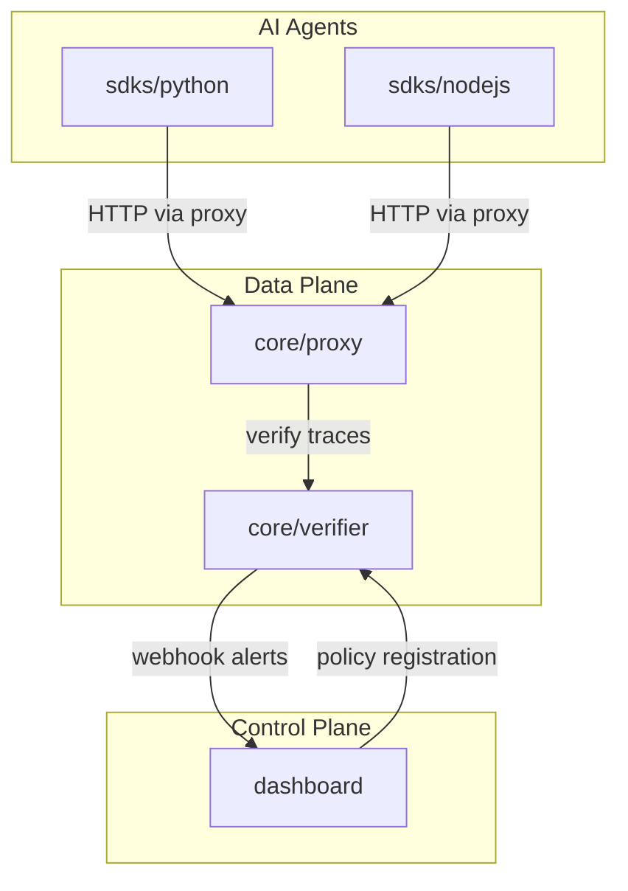

# Catenar

Zero Trust Network Access (ZTNA) proxy and cryptographic verifier for AI agents. Catenar inspects and enforces policy on outbound agent traffic, producing cryptographically verifiable Proof-of-Task receipts.

## Architecture



- **Data plane** (`core/proxy`, `core/verifier`): TLS MITM proxy with Rego policy evaluation; verifier signs receipts and validates traces
- **Control plane** (`dashboard`): Next.js UI for policy management and receipt viewing
- **SDKs** (`sdks/python`, `sdks/nodejs`): Lightweight client libraries for agents to register policies and emit traced calls

## Quick Start

```bash
# First run: create policy.json (or run make setup)
cp policy.json.example policy.json
# For a stricter quick test (e.g. block database.internal, admin.company.com): cp examples/policies/policy_quickstart.json policy.json
# Or run ./scripts/ensure-policy.sh (Unix) / .\scripts\ensure-policy.ps1 (Windows) before first docker compose up

# Start infrastructure
docker compose up -d verifier proxy web prometheus grafana

# Verifier: http://localhost:3000
# Proxy:   http://localhost:8080
# Dashboard: http://localhost:3001
# Grafana:  http://localhost:3002 (admin/admin)
```

**Python agents:** After the proxy starts, it writes the CA to `deploy/certs/ca.crt`. Run your agent from the repo root so `./deploy/certs/ca.crt` resolves, or set `REQUESTS_CA_BUNDLE` to an absolute path. Set `CATENAR_DEMO=1` before running your agent for auto proxy/CA config, or manually:

```bash
export HTTP_PROXY=http://127.0.0.1:8080 HTTPS_PROXY=http://127.0.0.1:8080
export NO_PROXY=127.0.0.1,localhost
export REQUESTS_CA_BUNDLE=./deploy/certs/ca.crt
```

See [docs/demo/getting-started.md](docs/demo/getting-started.md) for full demo instructions.

**CISO demo:** `docker compose up -d verifier proxy` → `python examples/bring_your_own_agent.py` from repo root → open Dashboard (http://localhost:3001) Receipts and Alerts.

## Component Index

| Component | Path | Description |
|-----------|------|-------------|
| Proxy | [core/proxy](core/proxy) | Forward proxy with TLS MITM, payload parsing, Rego policy |
| Verifier | [core/verifier](core/verifier) | Cryptographic verification and receipt signing |
| Crypto | [core/crypto](core/crypto) | Key generation and manifest signing (dev utility) |
| Python SDK | [sdks/python](sdks/python) | Catenar Proof-of-Task SDK for Python agents |
| Node.js SDK | [sdks/nodejs](sdks/nodejs) | Catenar Proof-of-Task SDK for Node.js |
| Dashboard | [dashboard](dashboard) | Next.js control plane UI |

## Policy: JSON-Only (No Rego)

Block hosts with `restricted_endpoints` in [policy.json](policy.json.example). No Rego required for basic endpoint blocking:

```json
{"restricted_endpoints": ["database.internal", "admin.company.com"]}
```

Rego ([policies/payload.rego](policies/payload.rego)) is optional for advanced rules: SSN detection, A2A trace headers, content inspection.

## Testing

Run all unit and integration tests:

- **Unix:** `make test` or `./scripts/test-all.sh`
- **Windows:** `.\scripts\test-all.ps1`

Optional: add `--swarm` (Unix) or `-Swarm` (Windows) to run the swarm demo after unit tests (requires verifier and proxy up).

| Component | Tests cover |
|-----------|-------------|
| Verifier | Schema, store, engine, HTTP handlers |
| Proxy | Intercept, trace_log, webhook |
| Dashboard | Auth, receipt-store, startup |
| Python SDK | Client, trace, identity |
| catenar-verify | CLI tool |

**Swarm demo (E2E):** Run with verifier and proxy up (`make demo` or `docker compose up -d verifier proxy`), then `python examples/swarm_demo.py` or `make test-swarm`. Verifies multi-agent parent_task_id lineage.

## Developer Tools

| Tool | Command | Description |
|------|---------|-------------|
| Debug Watch | `make debug` or `cargo run --manifest-path dev/cli/Cargo.toml -- debug watch` | Tail proxy trace WAL and show policy decisions, BLAKE3 hashes in real time |
| Chain Verify | `make verify` or `cargo run --manifest-path tools/catenar-verify/Cargo.toml -- ./data/proxy-trace.jsonl` | Verify BLAKE3 hash chain. Run against proxy WAL (`./data/proxy-trace.jsonl`), not SDK WAL (`catenar-trace-wal.jsonl`). |

## Examples

- **[examples/bring_your_own_agent.py](examples/bring_your_own_agent.py)**: Minimal BYOA — import `catenar_intercept` first, `init()` policy, then use requests/httpx as usual. Run from repo root: `python examples/bring_your_own_agent.py` (with verifier and proxy up). Or run from any directory: `./scripts/run-byoa.sh` (Unix) / `.\scripts\run-byoa.ps1` (Windows). See [docs/demo/getting-started.md](docs/demo/getting-started.md#bring-your-own-agent).
- **[examples/stress_test_agent.py](examples/stress_test_agent.py)**: Stress test with 100+ concurrent HTTP calls. Uses `catenar_intercept` for zero-config tracing. Run with proxy and verifier: `HTTP_PROXY=http://127.0.0.1:8080 python examples/stress_test_agent.py`

## Open Core

**Catenar Community Edition** is open source under the [Apache 2.0 License](LICENSE). See [docs/OPEN_CORE.md](docs/OPEN_CORE.md) for supported key providers (local, env) and what is available in Catenar Enterprise (KMS, Vault, Redis, SIEM).

## Documentation

- [Architecture](docs/ARCHITECTURE.md)
- [Proxy CA Trust](docs/proxy_mitm_ca_trust.md)
- [Security Audit](docs/SECURITY_AUDIT.md)
- [Design Standards](docs/web/design_standards.md)
- [Runbooks](docs/runbooks/)
- [Demo Getting Started](docs/demo/getting-started.md)

## Contributing

See [CONTRIBUTING.md](CONTRIBUTING.md) for how to report bugs, submit PRs, and contribute.

## Security

Report vulnerabilities per [SECURITY.md](SECURITY.md).

## License

[Apache License 2.0](LICENSE)
