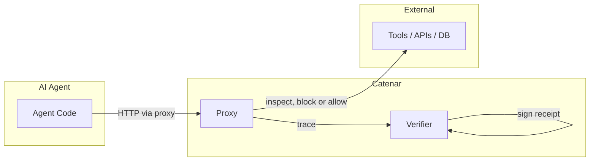

# CISO Demo Script (15 Minutes)

A scripted walkthrough for engineers to present Catenar to CISOs. Follow the steps in order; each has a suggested duration and talking point.

## Prerequisites

- Run `make demo` (or `./scripts/demo.sh`) so verifier, proxy, dashboard, and Grafana are up
- Dashboard: http://localhost:3001
- Grafana: http://localhost:3002 (admin / changeme-admin-demo-only)

**Fastest path:** `docker compose up -d verifier proxy` then `python examples/bring_your_own_agent.py` from repo root.

---

## Step 1: Architecture (1 min)

**Action:** Show the data flow diagram.



**CISO Message:** "Agents go through the proxy. We inspect every outbound call, enforce policy, and sign receipts. Nothing reaches external tools without our approval."

**Reference:** [ARCHITECTURE.md](../ARCHITECTURE.md)

---

## Step 2: Run the Demo Agent (2 min)

**Action:** From repo root:

```bash
cd sdks/python
python agent.py --demo
```

**CISO Message:** "This agent tries to access a salary endpoint. Policy blocks it. The receipt proves exactly what ran and what was denied. Policy blocks PII and restricted endpoints; the receipt is cryptographically bound to the policy we registered."

---

## Step 3: Receipts Page (3 min)

**Action:** Open Dashboard → Receipts (http://localhost:3001/dashboard/receipts).

**CISO Message:** "Each action is cryptographically bound to the policy. Every receipt has a trace hash, signature, and policy commitment. You can verify the chain with our CLI. This is audit-grade evidence for compliance."

**Show:** A receipt card with trace_hash, signature, policy_commitment.

---

## Step 4: Trigger an Alert (3 min)

**Action:** Run the demo again or use the stress test to hit a restricted endpoint. Or show an existing alert in Dashboard → Alerts.

```bash
python examples/stress_test_agent.py
```

**CISO Message:** "Violations appear in real time. When the agent tries to reach a blocked host, we block it and fire a webhook to the control plane. Alerts are grouped into incidents for forensics."

**Show:** Alerts page, incident detail.

---

## Step 5: Compliance Export (2 min)

**Action:** Dashboard → Compliance. Click "Download JSON export" or "Download CSV export".

**CISO Message:** "Audit data for your SIEM. Export receipts with timestamps, trace hashes, and policy commitments. Use the date range filters for Last 24h or Last 7d. Fields align with common SIEM ingestion patterns."

---

## Step 6: Swarm Lineage (2 min)

**Action:** Run swarm demo, then show Receipts page with lineage filter.

```bash
python examples/swarm_demo.py
```

**CISO Message:** "We trace agent-to-agent calls. When Agent A calls Agent B, we pass the parent task ID. You can query receipts by parent and see the full lineage. Critical for multi-agent systems."

**Show:** Receipts page, lineage filter by parent_task_id, receipt with parent_task_ids.

---

## Step 7: Enterprise Upgrade Path (2 min)

**Action:** Open [ENTERPRISE_BOUNDARY.md](../ENTERPRISE_BOUNDARY.md).

**CISO Message:** "Open Core covers testing and POC. For production, Enterprise adds HSM signing, HA idempotency, multi-sig policy validation, and distributed consensus. Here's the boundary."

**Reference:** [ENTERPRISE_BOUNDARY.md](../ENTERPRISE_BOUNDARY.md), [SECURITY_AUDIT.md](../SECURITY_AUDIT.md)

---

## Forensics

If the CISO asks about incident investigation:

- **Incident page:** Dashboard → Alerts → click incident. Shows related receipts (same policy commitment, ±5 min window) and a "Verify Chain" section.
- **Trace hash:** Run `make verify` or `cargo run --manifest-path tools/catenar-verify/Cargo.toml -- ./data/proxy-trace.jsonl` to verify BLAKE3 hash chain integrity of the proxy trace log.
- **Runbooks:** [docs/runbooks/](../runbooks/) for policy violation spikes, proxy unhealthy, verifier signing failure.

---

## Handoff

After the demo, share [CISO_HANDOFF.md](../CISO_HANDOFF.md) for a one-page summary and links to security audit and enterprise contact.
